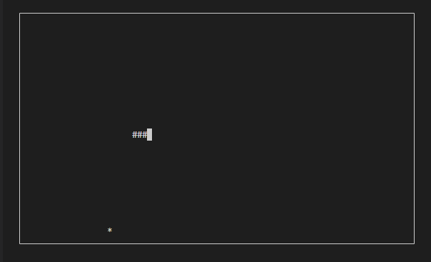
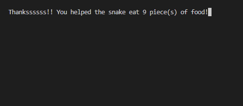
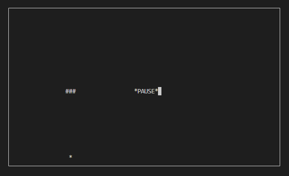
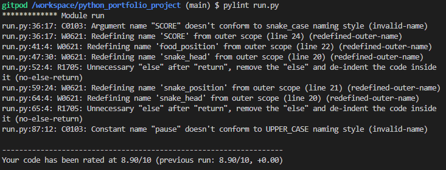
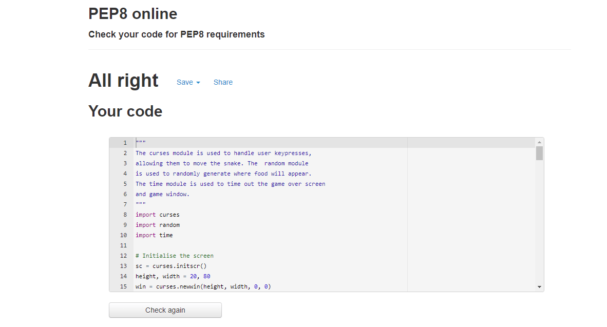

# Hungry Snake

## Project Overview

Hungry Snake - The classic mobile game makes it's way to the Python Command Line Interface and Code Institute mock terminal on Heroku!! Control the snake to eat food and grow as big as you can to earn more points. The game is over if the snake runs into the edge of the screen or it's own tail!

Please find the live version of the game [here](https://python-portfolio-project.herokuapp.com/).

## Project Goals and Target Audience

Hungry Snake is intended to be picked up and played by anyone! The aim of the game is to move the snake around the board using the direction keys and collect food. As the snake eats food, it becomes bigger and the user's score is increased. The game will end if the snake runs into the edge of the board or it it eats it's own tail. The game features a pause button using the space bar also.

### User Stories

I want a game I can pick up and play that doesn't take too much time. Snake is perfect for when I have a few minutes to kill while I'm waiting to join a call and want to occupy myself with something quick and fun. 

## Coding Languages Used

1. Python

### Modules Used

- The curses module has been imported to allow the terminal to be animated to create the game window. Curses can also handle user key presses and interact with the screen as a result of that input, thereby moving the snake around the game window.
- The random module has been imported and is used to randomly generate where the food items will appear on the window.
- The time module has been imported and is used to timeout the game over screen.

## Wireframes

1. Please see wireframe for the game on initialisation [here](assets/wireframes/main-game.png).
2. Please see wireframe for the paused game [here](assets/wireframes/pause-game.png).
3. Please see wireframe for the game over screen [here](assets/wireframes/game-over.png).

## Features

### Existing Features

1. Controlling the Snake. As soon as the game loads, the initial piece of food is created and users must use the directional buttons on their keyboard to steer the snake towards it.

2. Collision detection. As per the rules of the classic game, the game is over if the snake runs into the edge of the screen or into itself. The game has been coded to react to these instances when they occur and end the game when they do. When this happens, the game ends and a message appears telling the user how many pieces of food they obtained.

3. Pause button. The user can pause the game at any point by pressing the space key. No other key presses (including "ESC") will register on the program until the space key is pressed again.

4. Quit game. The user can quit the game and end the programme at any time by pressing the Escape key. This game is programmed to run as a "While Loop" that runs only while the key pressed by the user is NOT the escape key. Once pressed, the loop and game are closed.

### Future Features

1. Welcome menu. In a future update, I would like to include a main menu that appears when the user runs the program. This will be simple and say "Welcome to Hungry Snake" and will also ask the user for their name which will then appear by their final score.
2. Difficulty selection. It had originally been intended to include a feature that would allow the user to select a difficulty level which would be reflected in how fast the snake moves. However, I was unable to implement this in the timeframe available.
3. Mongoose mode. In a future update, I would like to create an extra difficulty that includes a mongoose (an animal known for preying on snakes) that also appears on the map and which players also must avoid while collecting food.
4. User save data. In a future update, I would like to include a feature that can retain the user's high score even after the game has been closed.

## Data Model

The programe is structured to operate as a while loop that will operate either until the snake collides with itself or the border, or until the user presses the escape key. The collision detection features (for the snake, border and food) are contained in separate functions. Within the while loop there are various if, elif, else statements that are required to handle the user key presses and determine how the snake moves.

## Testing

I have manually tested this project by doing the following:

- Passed the code through pylint and my code was rated 8.9/10. The majority of issues raised related to the use of global variables which would then be re-defined during the game loop. As the game is constantly moving and initial values were required, the global variables were a necessity. I understand the use of classes would have fixed most of these issues, however due to time constraints I was unable to utilise classes effectively in this initial version of the project.

- I have manually tested the directional key inputs, use of the space bar and use of the ESC key.
- Tested in my local terminal and the Code Intitute Heroku terminal.

### Validator Testing

Passed the code through PEP8 online and confirmed there are no problems

## Bugs

### Fixed Bugs

1. I had been having a significant issue while developing this project in trying to program the snake to move automatically in the direction of the last directional button the user pressed, until the next direction is pressed. Of course, this is a fundamental aspect of the game. In the initial incarnation of the project, the snake could only be moved manually as the user presses directional keys, effectively removing any difficulty from the game as users could just control the snake space by space. This led to me having to overhaul the code and use a different template to start with. While this was not ideal due to the impending deadline, the change was successful and the base game now runs as intended. Credit to the tutorial from The AI Learner below.
2. After programming the "Quit Game" and "Pause Game" features, I noticed while testing these features that if a player pressed the escape key while the game is paused, the input from pressing the escape key would appear as "^[" in the middle of the game board and would remain there even when the game is resumed. This was fixed by adding "curses.noecho()" to my code which effectively stops player input from being echoed to appear in the game window.

### Unfixed Bugs

1. The CLI cursor can still be seen on the head of the snake. This did not appear to be an issue until I first attemped to deploy this project on Heroku. Initially, my code included the command "curses.curs_set(0)" which renders the users cursor invisible while the programme is running. However, this returned an error when deploying on Heroku, preventing the game from running. Therefore, I had to remove the "curses.curs_set(0)" command in order to deploy successfully.
2. While the game is in motion, if a user holds down a key, the snake speeds up in the direction it is currently headed. I was unable to fix this issue in the given timeline and hope to look into it for a future update. Although, perhaps some users will look upon this as a feature!

## Deployment

This project was deployed using Code Institute's mock terminal for Heroku. At the time I had originally attempted to deploy this project on Heroku, deployments from Heroku were disabled due to security concerns. Therefore, I had to deploy via the Command Line Interface.

### Steps for deployment:

1. Create a new Heroku app.
2. Set the buildpacks to heroku/python and heroku/nodejs in that order.
3. Created a Config Var called PORT and set it to 8000.
4. In the Command Line Interface on GitPod, typed the command "heroku login -i" and logged in using my email and password in the Command Line Interface.
5. Got my app name from Heroku by typing in the command "heroku apps".
6. Set the heroku remote by typing heroku "git:remote -a python-portfolio-project".
7. Add and commit to GitHub and Heroku by typing "git add . && git commit -m "Deploy to Heroku via CLI"".
8. Pushed to both GitHub and Heroku by typing "git push origin main" and "git push heroku main".

## Credits

### Code Used
- Credit to YouTube user Indian Pythonista and their video [Creating Snake Game for Terminal | Intro to curses in Python (Part-3)](https://www.youtube.com/watch?v=BvbqI6eDh0c&list=WL&index=4) for the code used for the placement of the "*PAUSED*" text.
- Credit to The AI Learner and the article [Snake Game using Python Curses](https://theailearner.com/2019/03/10/snake-game-using-python-curses/) for code used as a template for this project.
- Credit to [sanchitgangwar on Github](https://gist.github.com/sanchitgangwar/2158084), for code used for the pause game and quit game features. 
- Credit to Code Institute for the deployment terminal.

### Acknowledgements
- My mentor Narender Singh for continuous helpful feedback.
- Tutor support at Code Institute for their support.